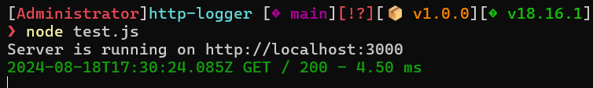

A simple and lightweight HTTP Logger for an Express.js application.

> NOTE: This package is still in development and has a number of upcoming features. You can read more about the features which will be added in the future in the **Upcoming Features** chapter at the bottom of the page

## Installation

In a NodeJS project using Express, run `npm install http-track` to install the package.

## How to setup

The package is created so that it can run out of the box simply by letting the application use it. Example shown below:

```
const express = require("express")
const { httpLogger } = require('./dist/index.js');

const app = express();

app.use(httpLogger());
```

The logger has default settings which make it incredibly simple to setup. All that is left to do is create some endpoint with Express.

```
app.get('/', (req, res) => {
    res.send('Hello, World!');
});

app.listen(3000, () => {
    console.log('Server is running on http://localhost:3000');
});
```

Upon performing a GET request to `http://localhost:3000` a message will be displayed in the console.



## Customization

### Formatting the logs

The logger has some simple parameters which can be shown or reordered:

- timestamp - the time when the request was made
- method - the type of method called (GET, POST, PUT, etc)
- url - the endpoint which was called
- status - the response status of the server
- response-time - the time taken for the response to be made (in ms)

By default the structure of the logs is the following:
':timestamp :method :url :status - :response-time ms'

You can change this by modifying the `format` parameter when creating the logger. The parameters can be removed or reordered.

```
app.use(httpLogger({ format: ':timestamp :method' }));
```

The color of the Logs can also be modified. By default the package uses the following object:

```
const defaultColors: Record<number, FontColor> = {
    500: FontColor.Red,
    400: FontColor.Yellow,
    300: FontColor.Blue,
    200: FontColor.Green,
}
```

This means that the logs will be displayed in Red for all the 5XX codes, in yellow for all the 4XX codes, etc.

If you wish to change this default behavior you need to provide a `colorOptions` parameter when initializing the package. It needs to have the same structure as the above-shown example. If any status code is missing the log will be displayed with the default white color.

The available colors which you can use can be found in the FontColor enum. They are the following:

```
export enum FontColor {
    Black,
    Red,
    Green,
    Yellow,
    Blue,
    Magenta,
    Cyan,
    White,
    Gray,
}
```

Example usage:

```
const { httpLogger, FontColor } = require('./dist/index.js');

const app = express();

const colors = {
    500: FontColor.Gray,
    400: FontColor.Blue,
    300: FontColor.Cyan,
    200: FontColor.Magenta
}

app.use(httpLogger({ colorOptions: colors }));
```

Disable colorful logs by simply providing the color parameter as false when initializing the logger: `app.use(httpLogger({ color: false }));`

>NOTE: If color is set to false, the colorOptions parameter gets ignored.

## Upcoming Features

- Further customization of the logs format
- Ability to write the logs to external files
- Ability to upload logs on third-party platforms
